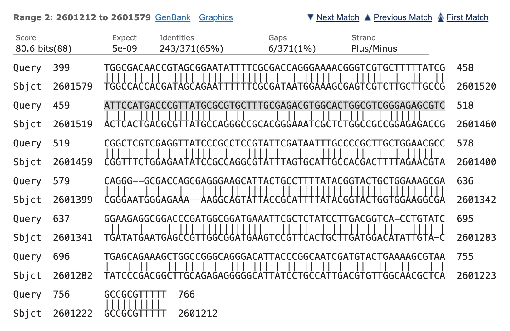

## Overview

This assignment is about solving problems using by breaking the problem down into smaller problems and then reassembling the solutions to the smaller problems into the solution to the original problem.  We will use a combination of divide and conquer algorithms and dynamic programming to solve these problems.

## Part 1: Creating a matrix class

For the first part of the assignment, we will be learning about a divide-and-conquer algorithm for matrix multiplication called [Strassen's Algorithm](https://en.wikipedia.org/wiki/Strassen_algorithm).

To get started, create Kotlin class capable of storing square matrices.  I won't be overly prescriptive about how you write your class, but you should support basic operations like creating a matrix of size $n$, setting / getting values at specified row and column indices, dividing the matrix into four $n/2 \times n/2$ matrices (this is needed for Strassen).  Don't worry about matrix multiplication yet, that's coming!

> **Pro tips:**
> 
> * You can make your matrix class especially nice by overloading operators (e.g., `+`, `*`). This will let you do things like ``A * B`` (assuming you have two ``Matrix`` objects ``A`` and ``B``).  If you don't use overloading, you might write ``A.multiply(B)``.  For more information, check out [the Kotlin documentation on operator overloading](https://kotlinlang.org/docs/operator-overloading.html).
> * To store the underlying data for your matrix, I have two recommendations.  First, you could store your data using an array of arrays structure (e.g., ``val data: Array<DoubleArray> = Array(n) { DoubleArray(n) }``).  Second, you could store your data as a linear array (e.g., ``DoubleArray(n*n)``) where the first row is laid out as the first ``n`` elements of the array, the next row is the following ``n`` elements of the array, etc.  This type of storage is called *row major* ordering.
{: .notice--success}

## Part 2: Strassen's Algorithm for Matrix Multiplication

Add the functions ``multiply`` and ``strassenMultiply`` to your matrix class. These functions should do the following (note: here I'm using ``Matrix`` as a stand-in for whatever you call your class from part 1 of the assignment)

```kotlin
class Matrix {
    // ... (other stuff omitted)
    
    /**
     * Multiply [this] matrix by [other].
     * You can implement this either using block-based matrix multiplication or
     * traditional matrix multiplication (the kind you learn about in math
     * classes!)
     * @return [this]*[other] if the dimensions are compatible and null otherwise
     */
    fun multiply(other: Matrix):Matrix? {
        // your implementation here
    }


    /**
     * Multiply [this] matrix by [other].
     * Your code should use Strassen's algorithm
     * @return [this]*[other] if the dimensions are compatible and null otherwise
     */
    fun strassenMultiply(other: Matrix):Matrix? {
        // your implementation here
    }
}
```

> Warning: there are some writeups of Strassen's algorithm that have errors in them.  Last time I ran this course, we found at least two different sets of class notes that had errors.  If you go from description on the Wikipedia page, then you should be good. 
{: .notice--danger}

Write some unit tests to show your code is correct.

* Time Strassen and regular matrix multiplication on various size problems.
* You may find the Strassen does not reliably outperform conventional matrix multiplication.  A hybrid approach may work better where you use conventional matrix multiplication for smaller matrices and Strassen for larger matrices.  What appears to be the optimal size matrix where you should switch between Strassen and conventional multiplication?

> What to turn in for this part:
> * Your Matrix class with all operations implemented, unit tested, and documented.
> * Benchmarks (meaning the runtime) of the two algorithms (as described above).
> * Your analysis of the performance of a hybrid algorithm that uses Strassen for large matrices and switches to conventional matrix multiplication for smaller matrices.
{: .notice--warning}

## Part 3: Dynamic Programming for Aligning Protein Sequences

Watch the following video [on the sequence alignment problem](https://www.youtube.com/watch?v=dYuktSSPfYQ).  Hopefully, it will give some good motivation behind what the problem is and why it's important.  There is also [a walkthrough of Needleman-Wunsch](https://www.youtube.com/watch?v=Lsa-VfSQgt4) that is pretty good.

Implement either the [Needleman-Wunsch Algorithm](https://en.wikipedia.org/wiki/Needleman%E2%80%93Wunsch_algorithm) or the [Smith-Waterman Algorithm](https://en.wikipedia.org/wiki/Smith%E2%80%93Waterman_algorithm) for sequence alignment.  Needleman-Wunsch is used for aligning two DNA sequences globally (an alignment between the entirety of each sequence is returned).  Smith-Waterman finds a local sequence alignment (it finds a part from each of the sequences that align well to each other).

You may find [this resource](https://rna.informatik.uni-freiburg.de/Teaching/index.jsp?toolName=Needleman-Wunsch) useful for testing your code and understanding the algorithms.  The Wikipedia pages are also a nice source for unit tests.

Your code should find both the best alignment and use backtracing to display the alignment itself.  You should use dynamic programming when implementing your algorithm.

Run your code on [the DNA sequence in this Kotlin file](https://github.com/OlinDSA2024/DivideAndConquerSample/blob/main/src/main/kotlin/Genome.kt).  This file has three variables.

* ``genomeSnippet`` is a snippet of a Salmonella genome.
* ``targetGenome`` is a long section of the Salmonella DNA (``genomeSnippet`` is contained completely within this string) 
* ``testAgainst`` is a different segment from the Salmonella genome (not exactly the same as ``genomeSnippet``) that you can use for matching.

If you are doing Smith-waterman you would match ``testAgainst`` and ``targetGenome``.  If all goes well, you should find that ``testAgainst`` matches well to the portion of ``targetGenome`` that contains ``genomeSnippet``.

If you are doing Needleman-Wunch, you can match ``genomeSnippet`` against ``testAgainst``.  You should find that your algorithm is able to closely align the two sequences.

Here is an alignment between part of a Salmonella genome and another part of the same genome.



I got this alignment by using a tool call [Nucleotide blast](https://blast.ncbi.nlm.nih.gov/Blast.cgi?PROGRAM=blastn&PAGE_TYPE=BlastSearch&LINK_LOC=blasthome) on ``genomeSnippet`` and selecting optimize for somewhat similar sequences.  The two parts of the alignment correspond to proteins that help the Salmonella cell infect the cells of the body.  One protein helps with the initial entry into the cell whereas the other protein helps with manipulating the functions of the cell the bacteria has entered the cell.

> What to turn in for this part:
> * Your implementation of one of the two algorithms for sequence alignment.  Functions should be unit tested and commented.
> * The result of running your code on the provided DNA sequences.  This should consist of the best matching sequence to the query.
{: .notice--warning}

## Turning in your work

Submit a link to a repository that has your code and writeup.  Make sure to add ``paulruvolo`` as a collaborator if the repo is private.  See the **what to turn in for this part** sections above for guidance on completing each part.

## Assessment

See the rubric on Canvas.
