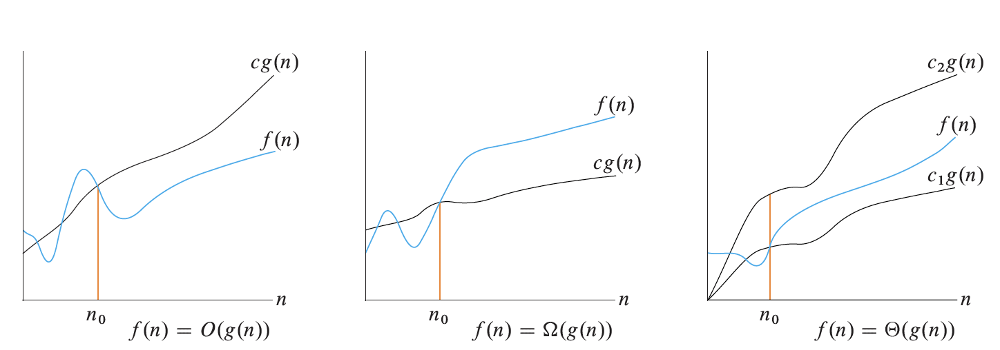

## Announcements and Reminders

* If you haven't yet, please fill out the office hours when2meets (see Canvas).
* Consider joining the Slack.

## Algorithm Design Patterns Tour


We're going to take a few classes to get a feel for the various algorithmic design patterns we will meet this semester.  Today, we'll be learning about greedy algorithms.

Wikipedia has a concise definition of a greedy algorithm.

> A greedy algorithm is any algorithm that follows the problem-solving heuristic of making the locally optimal choice at each stage.

The question becomes, does the greedy strategy lead to an optimal solution to the problem?  In some cases it may lead to such a solution, and in other cases it may not.

### Meeting Conflicts Revisited

Before we dive into a new problem, let's think back to the meeting scheduler problems we worked on last class.  Specifically, let's  look at the solution to the fourth problem, which is to find a way to assign meetings to rooms such that no conflicts occur and we use as few rooms as possible. Here is my solution.

Before we start, let's assume we have transformed our original list of meetings into a list of events (meeting starts and stops) ordered by time.

For example,

> A: 10:00–11:00
>
> B: 10:15–10:45
>
> C: 11:15–12:00
>
> D: 10:30–11:30


Is represented by the following, time-sorted list of events.

```
- time=10, isStart=true, runningTotal=1, meetingID=A
- time=10.25, isStart=true, runningTotal=2, meetingID=B
- time=10.5, isStart=true, runningTotal=3, meetingID=D
- time=10.75, isStart=false, runningTotal=2, meetingID=B
- time=11, isStart=false, runningTotal=1, meetingID=A
- time=11.25, isStart=true, runningTotal=2, meetingID=C
- time=11.5, isStart=false, runningTotal=1, meetingID=D
- time=12, isStart=false, runningTotal=0, meetingID=C
```

We'll populate a dictionary ``assignments``, which will hold the room ID (value) for each meeting (key).  Let's assume the rooms are identified by number, starting from $1$ (the second room is $2$, third room is $3$, etc.).

```
assignments = {}
availableRooms = [1]        // start with only room 1 (add more if needed)
nextRoom = 2                // we'll use room 2 next.

for (t, isStart, runningTotal, meetingID) in events
   if isStart
     if availableRooms.isEmpty
        availableRooms = [nextRoom]
        nextRoom = nextRoom + 1
     assignments[meetingID] = availableRooms.first()
     // remove the first element of the list since it is no longer available
     availableRooms.removeFirst()
   else
     // now that the  meeting is done, add the room back to the list of available rooms
     availableRooms.append(assignments[meetingID])
```

> **Exercise 1**
> Questions for you to work through in small groups (we'll come back together to discuss):
> * Make sure the algorithm makes sense (perhaps simulate what it would do given the sample inputs above)?
> * What decisions is this algorithm making?  Are the decisions locally optimal?
> * Is the algorithm above greedy?  Why or why not?
> * Is the algorithm above correct in the sense that it will always result in assigning the meetings to the fewest number of rooms?
> 
> As a group, let's think through the following question.  How would we modify the problem framing such that this greedy algorithm would no longer work?
{: .notice--success}


The algorithm is effectively deciding at each timepoint whether to use a room from ``availableRooms`` or use a completely new room.  The decision is always made to use a room from ``availableRooms``, which is locally optimal in the sense that it doesn't increase the total number of rooms used thus far.  The choice to make decisions that are locally optimal makes this a greedy algorithm.

The algorithm is correct in the sense that it will use the fewest number of rooms.  This can be seen by making note of the fact that a new room will be brought in by incrementing ``nextRoom`` only when all previously used rooms are in use.  This means that at the end of the algorithm's run, the value of ``nextRoom`` will be exactly 1 more than maximum number of meetings that simultaneously occur.  Further, the number of rooms we used in total will be ``nextRoom`` minus 1, which is exactly equal to the maximum number of simultaneously active meetings.  We know that no algorithm can use fewer than this number because there wouldn't be enough rooms for the busiest time, therefore the algorithm here uses the fewest rooms possible.



### Greedy Knapsack

> **Sample Problem** Seeing where a greedy approach fails
> 
> To make sure we understand which problems can be solved with a greedy algorithm, it may be more intuitive to think about some cases that a greedy algorithm cannot solve. Let's work through an example of this to all get on the same page.
> 
> *Knapsack Problem*: Given $N$ items where the $i$th item weights $w_i$ pounds, determine an assignment of items to two knapsacks such that the combined weight of the items in each knapsack is the same.
> 
> **Example:** There are five items with weights $6, 5, 9, 1, 1$.
> 
> **Solution:** Knapsack 1: $\{5, 6\}$, Knapsack 2: $\{1, 1, 9\}$.
>
> 
> What's the greedy approach?  Let's start with the knapsacks empty and choose the combination of knapsack and item that causes the total weight in each knapsack to stay as close as possible.  Let's track how the knapsacks $K_1$, $K_2$, and the remaining items, $R$, would evolve over time if we applied this procedure.
> 1. $K_1 = \[ 1 \], K_2 = \[ \], R = \[6, 5, 9, 1\]$
> 2. $K_1 = \[ 1 \], K_2 = \[ 1 \], R = \[6, 5, 9 \]$
> 3. $K_1 = \[ 1, 5 \], K_2 = \[ 1 \], R = \[ 6, 9 \]$
> 4. $K_1 = \[ 1, 5 \], K_2 = \[ 1, 6 \], R = \[ 9 \]$
> 5. $K_1 = \[ 1, 5, 9 \], K_2 = \[ 1, 6 \]$
> 
> This approach has clearly failed since the weights in $K_1$ total 15 and the weights in $K_2$ total 7.
{: .notice--info}

Now, let's work through the following exercise as a group.

> **Exercise 2**
> 1. Suppose you have a budget of $N$ dollars to purchase flour and that flour can be purchased on day $i$ for $x_i$ dollars per pound.  Determine the maximum amount of flour you can purchase with your budget.  Is your algorithm a greedy algorithm? (you can assume that buying a fraction of a pound is allowed).  How would you modify your algorithm if you were limited to purchasing $M$ pounds of flour each day?  Is the new algorithm greedy?
> 2. Determine a greedy algorithm for making change for $N$ cents using quarters, dimes, nickels, and pennies.  Does your greedy algorithm use the fewest coins possible (make an intuitive argument, no proof necessary)? 
> 3. If the US began minting a 20-cent coin, would a greedy algorithm still solve the optimal change-making problem? (Wikipedia has some useful information on [the change-making problem](https://en.wikipedia.org/wiki/Change-making_problem) if you want to learn more)
{: .notice--success}


1. A simple algorithm would be to choose the day with the lowest price ($x_i$) and then buy $\frac{N}{x_i}$ pounds on that day.  This would be a greedy algorithm since when faced with our initial decision of when to buy, we choose the best option without considering future decisions (although in this case we just make one decision).  If we were limited to purchasing $M$ pounds of flour each day, we could simply buy $M$ pounds of flour on the cheapest day (or less if we can't afford $M$ pounds).  If we still have more money to spend, buy on the next cheapest day and so on.  This is still a greedy algorithm since we choose the next day to buy flour without considering the impact on future decisions.
2. Sequentially add coins one at a time until you've made change for the total amount.  The greedy approach is to always use the largest denomination coin that doesn't result in giving too much change.  For instance, if we need to make change for $20$ cents, we use a dime.  We continue to subtract the value of the coin we just used and then repeat the procedure for the remainder.  In our example, after we allocate a dime, we would still have to make change for $10$ cents, so we would choose a dime as our second coin (resulting in change for 20 cents consisting of 2 dimes in total).  It's hard to make a convincing argument that this is optimal, but intuitively you could say that there is no amount of change that requires $5$ pennies (always better to use a nickel).  There is no amount of change that requires $2$ nickels (can always substitute a dime).  There is no amount of change that requires $3 dimes$ (can use a quarter and a nickel).  These restrictions mean that the greedy approach will always be best.
3. Once you have a $20$ cent coin, the greedy approach fails.  A specific example is $40$ cents, where the greedy approach would allocate $3$ coins (1 quarter, 1 dime, and 1 nickel).  In contrast, you could have used two 20-cent coins.





### Optimal Roadtripping

> **Exercise 3** You are planning a road trip of $N$ miles.  Your electric car has a range of $M$ miles.  There are charging stations located at mile $a_1, a_2, a_3, \ldots, a_k$ (as measured from the start of the route).  Determine a procedure to figure out the minimum number of recharges you have to make in order to complete the road trip.
> 
> <button onclick="HideShowElement('HideShow1')">Show / Hide Hint 1</button>
> <div id="HideShow1" style="display:none">Start by thinking about the first decision you have to make (where to make your first recharging stop).  Is there a best first place to stop?</div>
> <button onclick="HideShowElement('HideShow2')">Show / Hide Hint 2</button>
> <div id="HideShow2" style="display:none">Assuming that you recharge completely each time you choose to stop, does it ever make sense to stop at an earlier charging station than you could have reached?</div>
{: .notice--success}


A greedy algorithm would be to determine your first stop by going to the farthest charging station that your range allows.  After fully recharging, you choose the next stop by computing the farthest charging station you could reach.  You repeat this procedure until you have a plan for the whole trip.

This algorithm would result in the fewest stops because any algorithm that makes an earlier stop to charge would necessarily pass by the charging station that you chose with less charge left in the battery.  This means that this hypothetical alternative plan would necessarily have stopped the same number of times as you, but it would have less range left at the same point along the route.  There is no way that having range at the same point on the route can be advantageous.




## O() and Friends


Next, we are going to return to what we did in the first class where we calculated the runtime of an algorithm as a function of the input size $n$.  Let's say we compute the runtime of an algorithm 1 to be $2 n^2 + 5n + 200$ and the runtime of algorithm 2 to be $3 n^2 + 2 n$.  Is one necessarily faster than the other?  We can graph the two runtimes and see.

<div id="plot"></div>
<script>
  Plotly.newPlot("plot", [{
    x: [...Array(20).keys()],
    y: [...Array(20).keys()].map(i => 2*i*i + 5*i + 200),
    mode: 'lines',
    name: "algorithm 1"
  }, {
    x: [...Array(20).keys()],
    y: [...Array(20).keys()].map(i => 3*i*i + 2*i),
    mode: 'lines',
    name: "algorithm 2"
  }], { xaxis: { title: "Input Size" },
        yaxis: { title: "Runtime" } } );
</script>

Something interesting happens around $n=16$ (the lines cross).  However, if we let the input size get really large and plot the ratios of the two runtimes, we can see that algorithm 2 takes 50% longer to run than algorithm 1.

<div id="plot2"></div>
<script>
  Plotly.newPlot("plot2", [{
    x: [...Array(1000).keys()],
    y: [...Array(1000).keys()].map(i => (3*i*i + 2*i)/(2*i*i + 5*i + 200)),
    mode: 'lines',
    name: "algorithm 2 runtime / algorithm 1 runtime"
  }], { xaxis: { title: "Input Size", range: [10,1000] },
        yaxis: { title: "Relative Runtime", range: [0, 2] } } );
</script>

The idea behind order of growth, is to find a way to draw meaningful distinctions between how fast functions increase.  Where meaningful in this case is based on how the functions behave when their inputs, $n$, get very large and where we ignore constant factor differences in the functions (e.g., if a function is twice another, it is pretty much the same for our purposes).


We say that $f(x) = O(g(x))$ if there exists a positive real number $M$ and a real number $x_0$ such that, $\|f(x)\| \leq M g(x)~\text{for all}~x\geq x_0$.

> I always found the notation $f(x) = O(g(x))$ to be quite confusing.  What in the world does it mean for a function $f(x)$ to be equal to $O(g(x))$?  What clicks for me is to think of $O(g(x))$ as defining a set of functions.  The set of functions is precisely those functions that meet the criterion listed above.  The notation $f(x) = O(g(x))$ can be understood as stating that $f(x)$ is a member of the set $O(g(x))$.
{: .notice--info}


$f(x) = \Omega(g(x))$ if there exists a positive real number $M$ and a real number $x_0$ such that, $\|f(x)\|\geq M g(x)~\text{for all}~x \geq x_0$

We say that $f(x) = \Theta(g(x))$ if $f(x) = O(g(x))$ and $f(x) = \Omega(g(x))$.

Here is a handy figure from "Introduction to Algorithms" by Cormen, Leiserson, Rivest, and Stein.



As a group, let's explain how the formal definitions (given earlier) relate to these pictures.

> **Exercise 4**
> 1. Show that $10000 n = O(n^2)$ (let's do this one together).
> 2. Show that $n^2 \neq O(n)$.
>    <button onclick="HideShowElement('HideShow3')">Show / Hide Hint</button>
>    <div id="HideShow3" style="display:none">Write out the condition for $O()$ and show that it cannot be satisfied.</div>
> 3. Show that $\frac{3^n}{10000} = \Omega(2^n)$
>    <button onclick="HideShowElement('HideShow4')">Show / Hide Hint</button>
>    <div id="HideShow4" style="display:none">Follow the blueprint by writing out the condition for $\Omega$.  You don't have to necessarily find $x_0$, but convince yourself that one exists.</div>
> 4. Argue (up to you how formal to make your argument) that any polynomial is $O(2^n)$
{: .notice--success}


<ol>
<li>
Let's choose $M=10000$ and $n_0=1$.
$$
\begin{align*}
M n^2 &= 10000n^2 \\
&\geq 10000 n, \forall n \geq 1
\end{align*}
$$
</li>
<li>
Since $M n < n^2$ for $n > M$, it will be impossible to choose a value of $n_0$ that causes $M n$ to be larger than $n^2$ for all $n \geq n_0$.
</li>
<li>Choose $M = 1$ and $n_0 = 1$.  As long as $n$ is at least 1, $3^n$ will be bigger than $2^n$.  To see this take the ratio of the two functions and take the log.  This gives us $\log \left (\frac{3^n}{2^n}\right) = n \log 3 - n \log 2 = n (\log 3 - \log 2)$.  We can see that the only way this could be negative is if $n < 0$.  Since we stated $n > 1$, we can disregard this possibility.
</li>
<li>
If we look at the highest degree term in the polynomial, $c n^k$, we can choose $M$ such that $M \geq c$ and choose $n_0$ to make $2^n \geq n^k$ (the other, lower degree terms could be dominated as well, but those would be strictly easier).  We can accomplish this by taking logs of the ratio (as in the previous problem).  $\log \left ( \frac{2^n}{n^k} \right ) = n \log 2 - k \log n$.  It's not easy to find the exact crossover point, but it's easy to see that there will be such a point since the $\log$ function grows much more slowly than $n$.
</li>
</ol>




> **Exercise 5** This problem is from former Olin Professor Allen Downey's Think Python second edition.   In this context, order of growth can be understood to mean $\Theta$.  I made one modification to part 3 of the exercise.
> 1. What is the order of growth of $n^3 + n^2$? What about $1000000 n^3 + n^2$? What about $n^3 + 1000000 n^2$?
> 2. What is the order of growth of $(n^2 + n)(n + 1)$?
> 3. If $f$ is in $O(g)$ and $g$ is a continuously increasing functions that grows infinitely large as $n \rightarrow \infty$, what can we say about $af+b$, where $a$ and $b$ are constants?
> 4. If $f_1$ and $f_2$ are in $O(g)$, what can we say about $f_1 + f_2$?
>    <button onclick="HideShowElement('HideShow5')">Show / Hide Hint</button>
>    <div id="HideShow5" style="display:none">What do we know about based on the fact that $f_1$ and $f_2$ are in $O(g)$, can we write down a useful condition?</div>
> 5. If $f_1$ is in $O(g)$ and $f_2$ is in $O(h)$, what can we say about $f_1 + f_2$?
>    <button onclick="HideShowElement('HideShow6')">Show / Hide Hint</button>
>    <div id="HideShow6" style="display:none">You can use max(g, h) to refer to the bigger of the functions.</div>
> 6. If $f_1$ is in $O(g)$ and $f_2$ is $O(h)$, what can we say about $f_1 \times f_2$?
{: .notice--success}


1. $n^3 + n^2 = \Theta(n^3)$, $1000000 n^3 + n^2 = \Theta(n^3)$, $n^3 + 1000000 n^2 = \Theta(n^3)$.  Note that the constants don't matter, and $\Theta$ is only determined by the highest degree part of the polynomial (in all cases $n^3$).
2. Using similar logic to before, we can see that it is $\Theta(n^3)$ (just multiply out the terms and find the highest degree term).
3. It will also be $O(g)$.
4. It will be $O(g)$.  We can adjust $M$ and $n_0$ so that $g$ dominates both $f_1$ and $f_2$.
5. It would be $O(max(g, h))$ (basically, whichever function is bigger at each value of $n$).
6. It would be $O(g \times h)$.




## Sample Implementation of the Longest Meeting Problem


Here is a video of me implementing the longest meeting problem in Kotlin.  While this is a pretty straightforward problem, you may find it useful how I go through the mechanics of setting up the project and the like.

> Note: I accidentally forgot to toggle off the "Create GitHub Repository" when creating the project.  This is needed if you want the parent folder to be the repository.
{: .notice--warning}

<iframe width="560" height="315" src="https://www.youtube.com/embed/VwZcEHzD70Q?si=KHs259ZY4UoNeKqz" title="YouTube video player" frameborder="0" allow="accelerometer; autoplay; clipboard-write; encrypted-media; gyroscope; picture-in-picture; web-share" referrerpolicy="strict-origin-when-cross-origin" allowfullscreen></iframe>