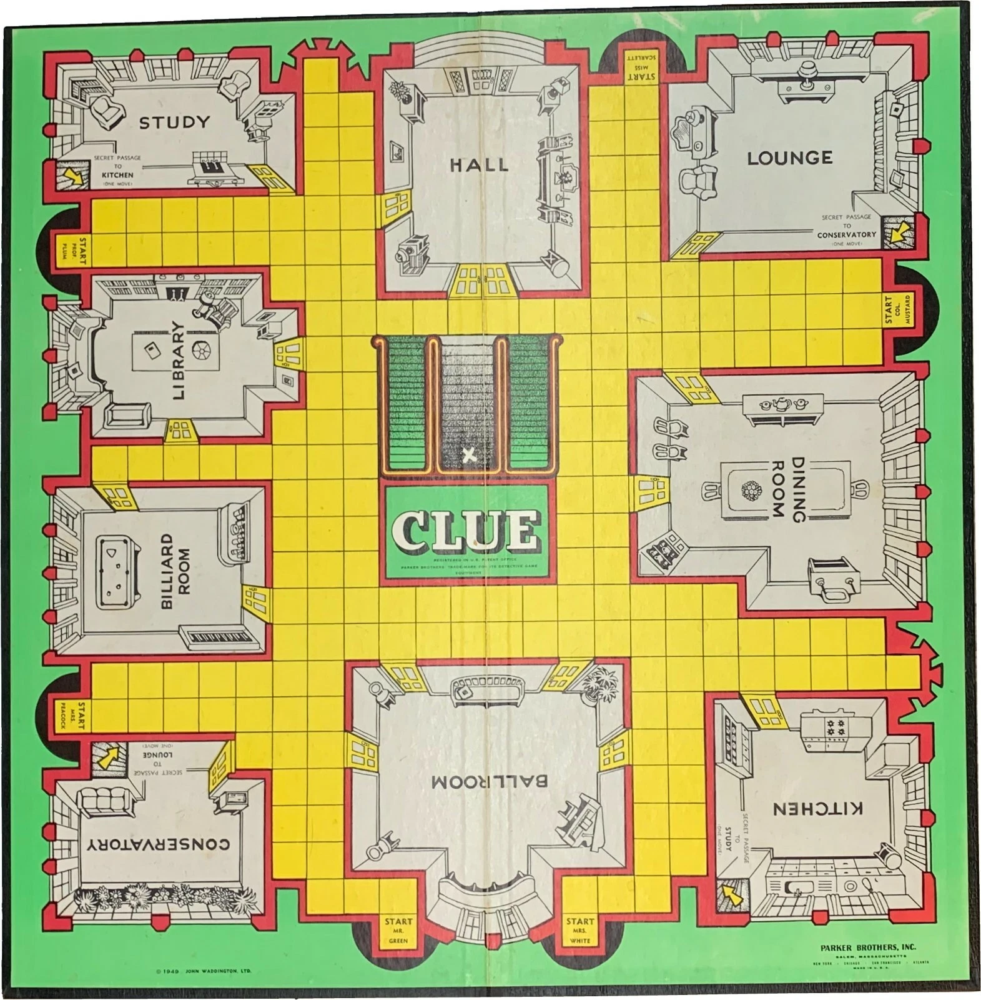

## Assignment Debrief


How did things go?  With those around you, make a list of questions that you still have regarding the assignment content.  We'll raise them to the group, and then I'll work to resolve them.  If you have any aspects of the assignment that you enjoyed or aspects that could be better, please raise that as well.

## A Few Words About Null Safety


One of the areas of Kotlin that provides a steep learning curve is dealing with optional values.  Here are [some resources](https://kotlinlang.org/docs/null-safety.html) to deal with nullable types (types that end with a ``?``).  Some useful patterns are shown below (source: https://kotlinlang.org/docs/null-safety.html)

```kotlin
// use smart casts so the compiler assumes a non-null type within the if statement
val x: Int? = 2
if (x != null) {
    println(2*x)
}
```
There are some tricky situations where this pattern will not work.  In particular, when you are dealing with variables that are class attributes.  Let's take a look at a version of our ``peek`` function from our stack.

This code provides a cryptic warning from the compiler.

```kotlin
    override fun peek(): T? {
        if (top != null) {
            return top.data
        }
        return null
    }
```

> Smart cast to 'MyStack.StackNode<T (of class MyStack<T>)>' is impossible, because 'top' is a mutable property that could be mutated concurrently.
{: .notice--danger}

The reason for this error is that it's possible your code could have multiple threads.  If you haven't heard of multithreaded programming, no worries.  We aren't going to be doing anything with it in this class, but conceptually you can imagine multiple tasks happening concurrently within your programming.  At the same time you are peeking onto the stack, another task could be modifying the stack in some way.  Due to this possibility, the compiler can't be sure that top will be non-null by the time you enter the ``let``.  A solution is to create a local variable first and use let on that.

```kotlin
    override fun peek(): T? {
        val currentTop = top
        if (currentTop != null) {
            return currentTop.data
        }
        return null
    }
```

If you want to make your code a little cleaner, you can define the local variable and the block of code to run if the expression is non-null in one go.  One way to do this is to use the ``let`` function.

```kotlin
    override fun peek(): T? {
        top?.let { currentTop ->
            return currentTop.data
        }
        return null
    }
```

You'll continue to get more practice with nullable types as we go, but I wanted to provide you with some guidance around what is a fairly difficult to understand error.

## (Adventure 1) Kotlin Arrays and Creating Our Own Mutable List


> This is a small extension of the challenge problem from last time.  I give this as an option to work on if you want more practice implementing data structures in Kotlin.
> 
> If you'd rather do more problem-solving with stacks and queues, you can skip to the next section.
{: .notice--success}

Kotlin has a built-in ``Array`` class ([documentation](https://kotlinlang.org/docs/arrays.html)) that can be used in much the same way as ``List`` (and mutable list).  The restrictions on ``Array`` mean that we can't add elements to it.

> **Exercise 1**: Using an Array as the underlying data structure, create a class called ``MyMutableIntList`` that can hold values of type ``Int`` (there a few hoops to jump through to make it hold any type, so let me know if you want to learn about that process).  Your class should support the following functions.
> 
> *Note 1:* the operator functions let you implement the same behavior that ``MutableList`` has in getting and setting elements (e.g., ``a[2] = 3``).
> 
> *Note 2:* when you create your class, you will need to think about how to grow your array when you run out of space.  In class we did some analysis that seemed to show that multiplying the array size by $2$ when it is full is faster than growing it by 1 each time.
{: .notice--success}

```kotlin
interface MutableIntList {
    /**
     * Add [element] to the end of the list
     */
    fun add(element: Int)

    /**
     * Remove all elements from the list
     */
    fun clear()

    /*
     * @return the size of the list
     */
    fun size(): Int

    /**
     * @param index the index to return
     * @return the element at [index]
     */
    operator fun get(index: Int): Int

    /**
     * Store [value] at position [index]
     * @param index the index to set
     * @param value to store at [index]
     */
    operator fun set(index: Int, value: int)
}
```

### Timing your code

You can add the following code to your ``main()`` function to see how efficient your class is for different list sizes.

```kotlin
fun main() {
    val arraySizes = listOf(100, 1000, 10000, 100000, 1000000, 10000000, 100000000)
    println("numberOfElements totalTime timePerElement")
    for (arraySize in arraySizes) {
        val myList = MyMutableIntList()
        val timeTaken = measureTime {
            for (i in 0..<arraySize) {
                myList.add(i)
            }
        }
        println("$arraySize $timeTaken ${timeTaken/arraySize}")
    }
}
```

If you find it useful, you can use this link to access [my solutions for this exercise](https://github.com/OlinDSA2024/Day05Finished).

## (Adventure 2) Solving Problems with Stacks and Queues


If you'd prefer to get more practice solving problems with stacks and queues, here are some suggestions.

> **Exercise 2**
> 
> [Implement Stacks Using Queues](https://leetcode.com/problems/implement-stack-using-queues/description/?envType=problem-list-v2&envId=stack)
>    <button onclick="HideShowElement('HideShow1')">Show / Hide Hint 1</button>
>    <div id="HideShow1" style="display:none">
         You do not need to maintain $\Theta(1)$ runtime for all stack operations.
>    </div>
{: .notice--success}

> **Exercise 3**
>
> [Evaluate Reverse Polish Notation](https://neetcode.io/problems/evaluate-reverse-polish-notation?list=neetcode150).  There are some embedded hints on this page.
{: .notice--success}

## Intro to Graphs


In the next assignment we're going to dive into the world of graphs and graph searching.  Before we do so, let's take some time to understand what a graph is.

Graphs are ways to represent relationships between entities of some sort.

> **Exercise 4**: before we define some important vocabulary to talk about graphs, with those around you, come up with a couple examples of systems that fit this pattern. The systems you consider could be social, geographical, computer-based, informational, etc.
> {: .notice--success}

To formalize this a bit more, we use the terminology of *vertices* or *nodes* to refer to the entities in our graph (e.g., the people or websites in our examples above).  We use the term *edges* to represent the relationships (e.g., the existence of a friendship or a link in our two examples above).  In graph theory and algorithms, there are many different types of edges (e.g., directed, undirected, weighted, multi-edges) to represent different sorts of relationships.

For now, we're going to consider the case of directed edges where an edge encodes a unidirectional relationship between two entities.  For example, a directed edge from the node ``olin.edu`` to ``google.com`` might represent that Olin's website links to Google's website.

## Clue Speedrun




This is an image of the 1949 edition of the board game Clue.  In the game, players have to solve a crime by determining the murderer, the weapon, and the room they committed the crime within.  Part of the game involves moving around the board and visiting different rooms.  Players gather evidence about which room the murder happened in by moving to that room.  In this problem, we're not going to be worried so much about the process of gathering information about the crime, but instead we are going to focus on visiting each room as quickly as possible.

Here are the rules for movement:
* Players can only move up, down, left, or right (not diagonal)
* To enter a room, you need to move to the space immediately adjacent to the door and then enter the room. Entering the room does not count as a move.
* Many rooms have more than one entrance.
* You can exit a room through any door.
* There are secret passages that connect rooms on the diagonals.

Work on these in a group of 2-4 people.

> **Exercise 5**
> Suppose you want to speedrun from one room to another.  Let's think about how we would compute the fewest number of moves to go between two arbitrarily chosen rooms on the board.  Consider using a secret passage as consisting of one move.
> Step 1: represent the board as a graph (maybe come up with a smaller board to make things easier at first).  What are the nodes what are the edges?  There are multiple ways to do this, so don't feel like there is a right answer.  Since we are considering directed graphs right now, you may want to use two edges to represent the fact that you can move from space A to B or B to A.
> Step 2: given a starting location, show how you would annotate your graph to mark the distance between each node and the starting location.
> Step 3: once you are done annotating, how would you determine
> the fewest number of moves to go between the start and the end room.
> Step 4: suppose you wanted to compute the actual shortest path (the sequence of moves).  How could you use your annotation to compute this sequence?
> Step 5: suppose you are given a data structure to represent the graph.  Given a node, you can query for all adjacent nodes.  If you were to implement the annotation process in a computer, what data structure might you use?  Consider the data structures from the previous homework (stacks and queues).  Consider trying each structure and seeing how it would annotate the graph.  What issues might arise that you would need to take care of?
{: .notice--success}

> **Exercise 6**
> What if the cost of using the secret passage is more than a typical move?  If it costs $N$ moves to use the passage, how would you modify your solution to the previous exercise to accommodate for this?  You can assume $N$ is a positive integer.
{: .notice--success}


## Representing Graphs in a Programming Language


Before we get into the theory of graphs and the sorts of algorithms we might run on them, let's introduce the concept of an [adjacency list](https://en.wikipedia.org/wiki/Adjacency_list), which is a particular way to represent graphs in a computer program.  Note that this is not the only way to represent a graph in a computer program, but it is a very popular one.

> **Exercise 7**: read about adjacency lists.  On a chalkboard (or piece of paper at your table) write out a plan for how you would implement an adjacency list in a programming language (you could choose a specific language, or do this in a language agnostic way).  Your plan might be fairly abstract (e.g., listing out particular classes and functions without worrying about syntax).
{: .notice--success}

Specifications:
* To represent your vertices, you could choose a particular type (e.g., ``String``), or you could use [generics](https://kotlinlang.org/docs/generics.html) to make it work for any class (in languages other than Kotlin, there are similar ideas).
* At a minimum, your class should support the ability to add new vertices, add new edges, and get the list of vertices that are connected to a given vertex.